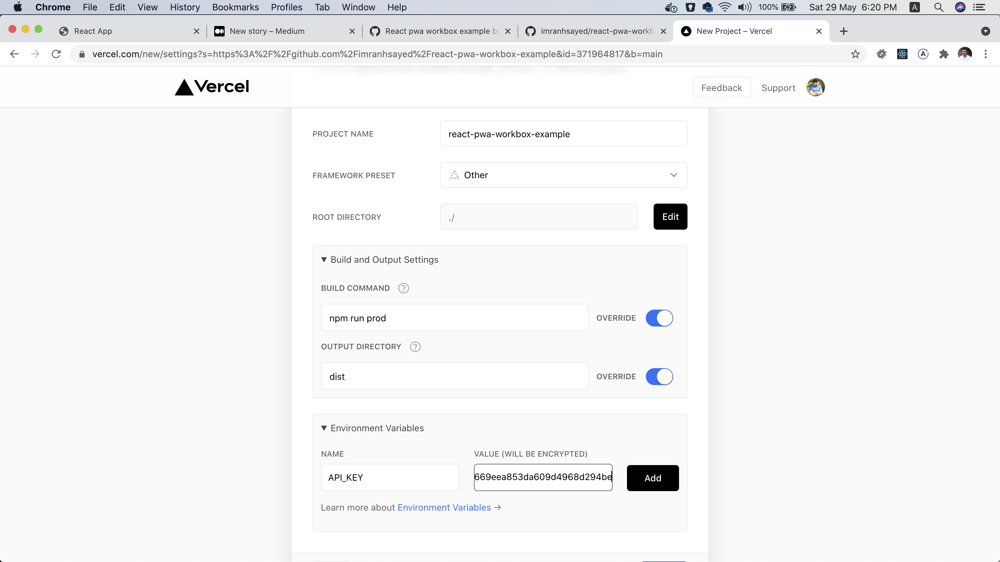

# [React PWA Workbox Example](https://netflix-homepage-ecru.vercel.app/)

:fire: This is a React PWA Workbox Example for learning how to build React PWA.

## Demo Site

https://netflix-homepage-ecru.vercel.app/

* Landing page

## Branch Description:
Create a `.env` taking example from `.env-example` and Put your api key by getting it from 'https://developers.themoviedb.org/3'

## Installation

1. Clone this repo in `https://github.com/jidonusegun/netflix-homepage`

2. `cd react-pwa-workbox-example`

3. Run `npm install`
3. Run `npm run dev`

## Commands

- `dev` Runs webpack dev server for development ( in watch mode ) at http://localhost:8080/
- `prod` Runs webpack build
- `serve` Runs production server at 'http://localhost:5000/'

## Deployment on vercel.

* Vercel config

  
## References

### [workbox-core](https://developers.google.com/web/tools/workbox/modules/workbox-core)
### [workbox-window](https://developers.google.com/web/tools/workbox/modules/workbox-window)
### [workbox-precaching](https://developers.google.com/web/tools/workbox/modules/workbox-precaching)
### [workbox cacheable response](https://developers.google.com/web/tools/workbox/modules/workbox-cacheable-response)
### [workbox-clientsclaim](https://developers.google.com/web/tools/workbox/modules/workbox-core#clients_claim)
### [workbox-webpack-plugin](https://developers.google.com/web/tools/workbox/modules/workbox-webpack-plugin)
### [InjectManifest](https://developers.google.com/web/tools/workbox/reference-docs/latest/module-workbox-webpack-plugin.InjectManifest)

### [Workbox Routing](https://developers.google.com/web/tools/workbox/modules/workbox-routing)
### [Caching Route Recipes](https://developers.google.com/web/tools/workbox/guides/common-recipes)

### [Workbox Caching Strategies](https://developers.google.com/web/tools/workbox/modules/workbox-strategies)

